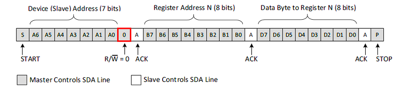

# I2C(Inter-Integrated Circuit)

> 2개의 선을 이용하여 Master-Slave 형태로 통신하는 방식

## 특징
- `SDA`(Serial Data)와 `SCL`(Serial Clock) 2개의 선을 이용하여 데이터 송수신
- Clock을 이용한 동기식 통신
- 반이중 통신
- Master : Slave = 1:N 통신이 가능
- 각 Slave는 개별 주소를 가지고 있음. -> 이를 통해 데이터를 제공하는 디바이스 특정 가능

 

## I2C 데이터 송수신

### I2C Write

**통신 순서**
1. Start 조건 이후, Slave 주소 `7bit`와 R/W(Read:1, **Write:0**)값 `1bit` 전송
   - Master가 출력한 Slave 주소가 있다면, 해당 Slave는 Master로 `ACK` 신호 전송
   - Master가 출력한 Slave 주소가 없다면, ACK bit의 상태가 '1'을 유지 -> `NACK`

> **Warning**   
> 이후부터는 Datasheet 마다 규칙이 다르므로 위의 그림을 기준으로 서술함을 참고할 것.

2. Slave의 Register 주소 `8bit`를 전송
   - 이후 주소가 있다면 ACK 신호 전송. 없다면 NACK 유지
3. Data `8bit` 전송
    - 보통 8bit 전송, ACK 반환의 반복을 통해 데이터를 전송함.
4. Stop 비트 전송으로 Data Write 마침.

